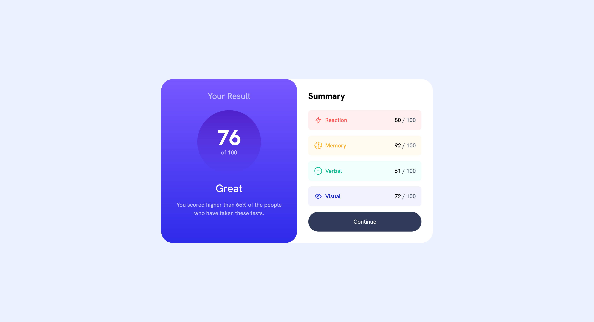

# Frontend Mentor - Results summary component solution

This is a solution to the [Results summary component challenge on Frontend Mentor](https://www.frontendmentor.io/challenges/results-summary-component-CE_K6s0maV). Frontend Mentor challenges help you improve your coding skills by building realistic projects.

## Table of contents

- [Overview](#overview)
  - [The challenge](#the-challenge)
  - [Screenshot](#screenshot)
  - [Links](#links)
- [My process](#my-process)
  - [Built with](#built-with)
  - [What I learned](#what-i-learned)
- [Author](#author)

## Overview

### The challenge

Users should be able to:

- View the optimal layout for the interface depending on their device's screen size
- See hover and focus states for all interactive elements on the page
- **Bonus**: Use the local JSON data to dynamically populate the content

### Screenshot

### Links

- Solution URL: [https://github.com/dirkvankrieken/Results-Component](https://github.com/dirkvankrieken/Results-Component)
- Live Site URL: [https://dirkvankrieken.github.io/Results-Component/](https://dirkvankrieken.github.io/Results-Component/)

## My process

### Built with

- React
- Vite
- TailwindCSS
- Flexbox
- Mobile-first workflow

### What I learned

How to build a very simple app with the React framework.
For example, how to split up a given design into components and how to use useEffect and useState React hooks to dynamically load data from a json file into the application.
Also learned how to use TailwindCSS within a React application.

## Author

- Frontend Mentor - [@yourusername](https://www.frontendmentor.io/profile/yourusername)
- Github - [github.com/dirkvankrieken](https://github.com/dirkvankrieken)
- LinkedIn - [in/dirk-van-krieken](https://www.linkedin.com/in/dirk-van-krieken/)
